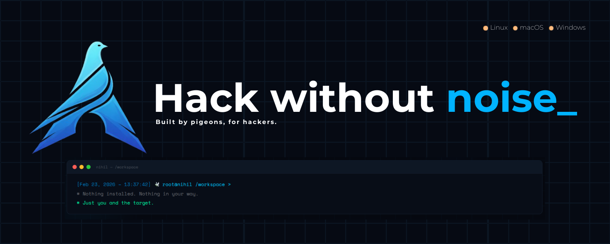

Nihil is a minimal offensive environment made for security experts, hackers, and students. It gives you ready-to-use Docker images and a CLI so you can spin up a lab without wrestling with base distros or manual installs—transparent, modular, and built for real work.

Want to know more? Go to the [project website](https://thenullpigeons.org).

## Getting started

How to install Nihil: [Get started / install](https://thenullpigeons.org/nihil#install).

The project documentation (images, CLI, usage) is available on the [documentation site](https://github.com/TheNullPigeons/nihil/wiki).
