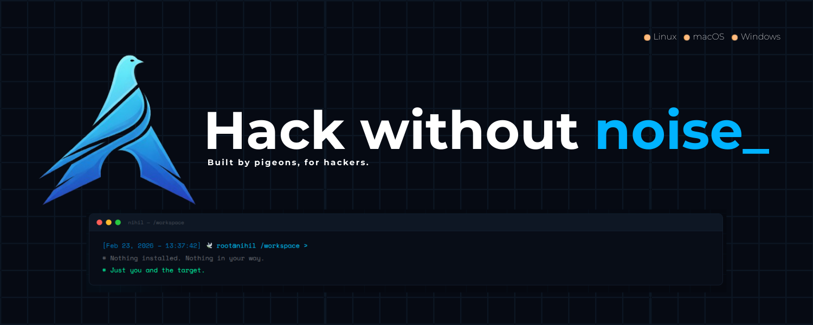

Nihil is a minimal offensive environment made for security experts, hackers, and students. It gives you ready-to-use Docker images and a CLI so you can spin up a lab without wrestling with base distros or manual installs, transparent, modular, and built for real work.

Want to know more? Go to the [project website](https://thenullpigeons.org).

## Getting started

How to install Nihil: [Get started / install](https://thenullpigeons.org/docs/installation/linux).

The project documentation (images, CLI, usage) is available on the [documentation site](https://thenullpigeons.org/docs).

## Customize an image

The following command asks for GitHub CLI authentication, creates or reuses a
personal fork of `nihil-images`, and opens the interactive tool selector:

```bash
nihil image customize web
```

In the selector, use the arrow keys (or `j`/`k`) to move. Press `/` to search
by tool, category, or command. Press `v` to enter visual mode, move with
`j`/`k` to select a range, and press `Space` to toggle all selected tools.
Press `Enter` to save, and `q` or `Esc` to cancel.

To use a group repository, add `--repo owner/repo` or its full GitHub URL.

Git remotes use SSH by default. Use `--git-protocol https` when HTTPS remotes
are preferred.

Use `--git-del` to remove and re-clone the existing local source directory.
This does not delete the remote GitHub repository.

Changes are stored on a `nihil/<variant>-custom` branch in the fork. With
`--no-push`, the branch is only prepared locally. Switch the active source with:

```bash
nihil image switch personal
nihil image switch upstream
nihil image status
```

`nihil info` shows the active source and its available variants. The installed
images and containers remain visible across source switches, with a `SOURCE`
column (`upstream`, `personal`, or `local`). The `USAGE` column shows `Used`
when a container references the exact image ID, including stopped containers. `Unused`
means no container references that image; `Unknown` means usage could not be
verified. Saved image copies with only a
`nihil/*` tag are shown as local.

Container update status compares the container image with its original Docker
reference available locally. Switching sources does not change that status.
`Unknown` means the reference cannot be resolved; this is not a remote registry
update check.

After pushing, trigger the fork's build workflow for a specific variant and
install the image published in its GHCR namespace:

```bash
nihil image build full --wait
nihil install web
```

Use `nihil image build` to build all variants.

To remove Nihil images that no container uses (including stopped containers):

```bash
nihil uninstall --unused
```

The command previews the images and asks for confirmation. Add `--force` to skip
confirmation; in this mode Docker removal is still unforced and containers are
never deleted. Image names cannot be combined with `--unused`.
